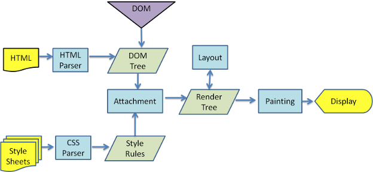

# 回流和重绘

## 游览器渲染过程

游览器渲染过程如下：

- 解析 HTML，生成 DOM 树
- 解析 CSS，生成 CSS DOM 树
- 将 DOM 树结合 CSS DOM 树生成渲染树（Render Tree）
- Layout 回流：根据生成的渲染树，进行回流，得到节点的位置信息
- Painting 重绘：根据生成的渲染树和回流得到的节点位置信息，得到节点的绝对像素
- Display：将像素发送给 GPU，并展示到页面。

## 何时触发回流

- 页面初次渲染
- 添加或者删除可见的 DOM
- 元素的位置信息发生改变
- 元素的大小发生改变
- 元素的内容发生变化
- 游览器窗口大小发生变化

## 何时触发重绘

- 发生回流一定触发重绘
- 当页面中元素样式的改变不影响元素在文档流中的位置，游览器会将新样式赋予元素进行重新绘制

## 注意

现代游览器会对频繁的回流和重绘操作进行优化，游览器会维护一个队列，把所有会引起回流和重绘的操作放入队列中，如果
队列中任务的数量或者时间间隔达到一个阈值，游览器将会清空队列，进行一次批处理，这样可以把多次回流和重绘合并为一次。

你访问一下属性时，游览器会立刻清空队列

- clientWidth、clientHeight、clientTop、clientLeft
- offsetWidth、offsetHeight、offsetTop、offsetLeft
- scrollWidth、scrollHeight、scrollTop、scrollLeft
- width、height
- getComputedStyle()
- getBoundingClientRect()

以上属性和方法都需要返回最新的布局信息，因此浏览器不得不清空队列，触发回流重绘来返回正确的值。因此，我们在修改样式的时候，**最好避免使用上面列出的属性，他们都会刷新渲染队列。**如果要使用它们，最好将值缓存起来。

## 如何避免回流和重绘

CSS

- 尽量避免 table 布局
- 尽量在 DOM 树的最末端改变 class
- 避免设置多层内联样式
- 将动画效果添加到 position 属性为 absolute 和 fixed 上
- 避免使用 CSS 表达式
- CSS3 硬件加速

JS

- 避免频发操作样式，最好一次重写 style 属性
- 避免频繁的 DOM 操作，可以创建一个 documentFragment，在此上面进行操作。最后把它添加到文档中
- 可以将元素设置为 display: none; 在进行样式操作，操作结束后再显示出来元素，display: none; 元素不触发回流和重绘
- 避免频繁读取会引发回流和重绘的属性
- 对具有动画的元素进行绝对定位，脱离文档流。
