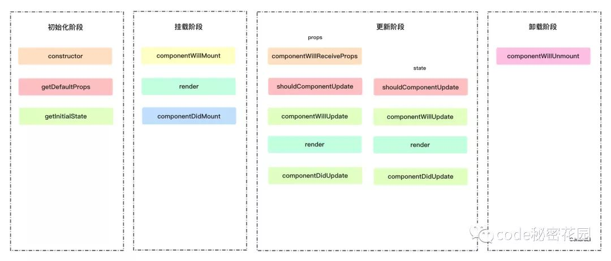
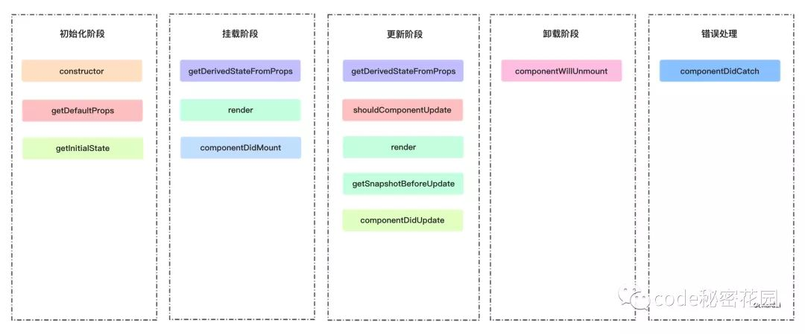

# react 生命周期

React17 将正式弃用 componentWillMount、componentWillReceivePorps，componentWillUpdate 新增 getDerivedStateFromProps、getSnapshotBeforeUpdate 来代替弃用的三个钩子函数。

## react 15 生命周期

## react 16 生命周期

- getDerivedStateFromProps：组件每次被 rerender 的时候，包括在组件构建之后(虚拟 dom 之后，实际 dom 挂载之前)，每次获取新的 props 或 state 之后；每次接收新的 props 之后都会返回一个对象作为新的 state，返回 null 则说明不需要更新 state；配合 componentDidUpdate，可以覆盖 componentWillReceiveProps 的所有用法

* getSnapshotBeforeUpdate：触发时间: update 发生的时候，在 render 之后，在组件 dom 渲染之前；返回一个值，作为 componentDidUpdate 的第三个参数；配合 componentDidUpdate, 可以覆盖 componentWillUpdate 的所有用法
