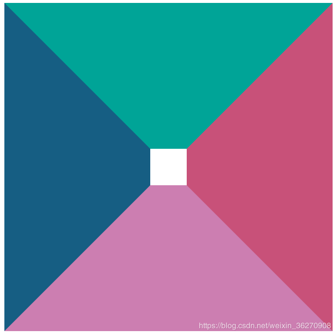
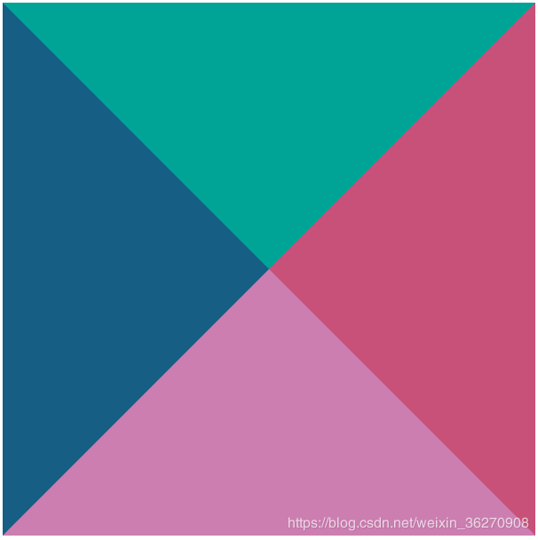
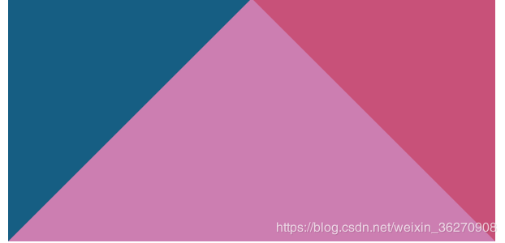
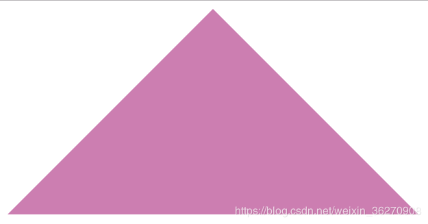

## CSS 伪类和伪元素

伪类和伪元素的定义

- 伪类用于在页面中某一个元素处于某一个状态时，为其添加制定的样式
- 伪元素会创建一个抽象的元素，这个元素不是 DOM 中的真实元素，但是会最终存在于渲染树中，我们可以为其添加样式。

### 伪类

由于状态的变化是非静态的，所以元素达到一个特定状态时，它可能得到一个伪类的样式；当状态改变时，它又会失去这个样式。由此可以看出，它的功能和 class 有些类似，但它是基于文档之外的抽象，所以叫伪类。

### 伪元素

CSS 伪元素是用来添加一些选择器的特殊效果。
CSS 伪元素控制的内容和元素是没有差别的，但是它本身只是基于元素的抽象，并不存在于文档中，所以称为伪元素。

### 两者之间的区别

- 伪类使用":",伪元素使用"::"
- 伪类可以使用 class 替代，伪元素必须要新建 dom 模拟

## CSS 单行和多行截断

### 单行截断

css 语句

- overflow: hidden；（文字长度超出限定宽度，则隐藏超出的内容）
- white-space: nowrap；（设置文字在一行显示，不能换行）
- text-overflow: ellipsis；（规定当文本溢出时，显示省略符号来代表被修剪的文本）

优点

- 无兼容问题
- 响应式截断
- 文本溢出范围才显示省略号，否则不显示省略号
- 省略号位置显示刚好

缺点

- 只支持单行文本截断

### 多行阶段 CSS 方案

css 语句

- display: -webkit-box;（和 1 结合使用，将对象作为弹性伸缩盒子模型显示 ）
- -webkit-line-clamp: 2;（用来限制在一个块元素显示的文本的行数, 2 表示最多显示 2 行。 为了实现该效果，它需要组合其他的 WebKit 属性）
- -webkit-box-orient: vertical;（和 1 结合使用 ，设置或检索伸缩盒对象的子元素的排列方式 ）
- overflow: hidden;（文本溢出限定的宽度就隐藏内容）
- word-break: break-all;（在任何地方换行）

优点

- 响应式截断
- 文本溢出范围才显示省略号，否则不显示省略号
- 省略号显示位置刚好

缺点

- 兼容性问题

### 其他方式

- js 封装
- 伪元素
- float

## CSS 画出一个三角形

1. 设置 div 有一定宽高，四边设置边框

```css
.triangle {
  width: 50px;
  height: 50px;
  border-top: 200px solid #00a497;
  border-bottom: 200px solid #cc7eb1;
  border-left: 200px solid #165e83;
  border-right: 200px solid #c85179;
}
```



2. 设置 div 宽高为 0，四边设置边框宽度为 200px

```css
.triangle {
  width: 0px;
  height: 0px;
  border-top: 200px solid #00a497;
  border-bottom: 200px solid #cc7eb1;
  border-left: 200px solid #165e83;
  border-right: 200px solid #c85179;
}
```



3. 接下来 div 宽高仍为 0，去掉 border-top

```css
.triangle {
  width: 0px;
  height: 0px;
  border-bottom: 200px solid #cc7eb1;
  border-left: 200px solid #165e83;
  border-right: 200px solid #c85179;
}
```



4. 最后发现，只将 border-bottom 设置颜色，左右边框透明，既可得到三角形

```css
.triangle {
  width: 0px;
  height: 0px;
  border-bottom: 200px solid #cc7eb1;
  border-left: 200px solid transparent;
  border-right: 200px solid transparent;
}
```



## html meta 作用

### 定义和用法

文章链接[HTML <meta> 标签](https://www.w3school.com.cn/tags/tag_meta.asp)

<meta> 元素可提供有关页面的元信息（meta-information），比如针对搜索引擎和更新频度的描述和关键词。
<meta> 标签位于文档的头部，不包含任何内容。<meta> 标签的属性定义了与文档相关联的名称/值对。

## CSS <link/>为什么要放在头部

首先 <link/>标签不需要强制放在头部，一般推荐放在头部更具有语义化，重点是 html 是从上往下执行，先加载样式资源利于用户交互。

`CSS 可以实现预加载资源，起到优化的作用`
