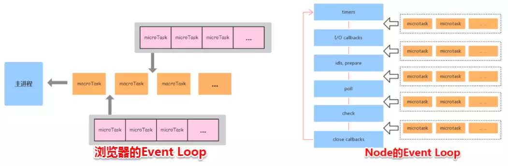
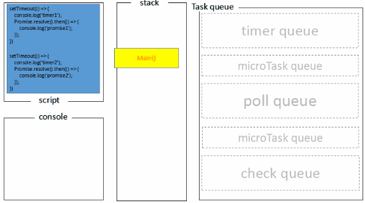

# 事件详解

## 游览器中的 Event Loop

### Macro Task && Micro Task

游览器端的事件循环中有两种异步队列，Macro 宏任务和 Micro 微任务。宏任务队列可以有多个，微任务队列只有一个。

- 常见的宏任务：setTimeout，setInterval，script 代码，I/O 操作，UI 渲染
- 常见的微任务：new Promise().then()，mutationObserver（h5API）

### Event Loop 解析过程

一个完整的 Event Loop 过程，可以概括为以下阶段：

总结后，每一次循环都是一个这样的过程

当一个宏任务执行完毕后，会检查是否有微任务队列。如果有先执行微任务中的所有任务，如果没有则取宏任务中排在最前面的任务，执行宏任务的过程中，遇到微任务，依次加入到微任务队列。以此类推。

### Node 中的 Event Loop

Node 中的 Event Loop 和浏览器中的是完全不相同的东西。Node.js 采用 V8 作为 js 的解析引擎，而 I/O 处理方面使用了自己设计的 libuv，libuv 是一个基于事件驱动的跨平台抽象层，封装了不同操作系统一些底层特性，对外提供统一的 API，事件循环机制也是它里面的实现（下文会详细介绍）。

Node.js 的运行机制如下：

- V8 引擎解析 js 脚本
- 解析后的代码，调用 Node API
- libuv 库负责 Node API 的执行，它将不同的任务分给不同的线程，形成一个 Event Loop， 以异步的方式将任务的执行结果返回给 V8 引擎。
- V8 引擎再将结果返回给用户

#### 六个阶段

其中 libuv 引擎中的事件循环分为 6 个阶段，它们会按照顺序反复运行。每当进入某一个阶段的时候，都会从对应的回调队列中取出函数去执行。当队列为空或者执行的回调函数数量到达系统设定的阈值，就会进入下一阶段。

外部输入数据 --> 轮询阶段(poll) --> 检查阶段(check) --> 关闭事件回调阶段(close callbacks) --> 定时器检测阶段(timer) --> I/O 事件回调阶段(I/O callbacks) --> 闲置阶段(idle,prepare) --> 轮询阶段 （按照此顺序，反复执行）

- timer：这个阶段执行 timer（setTimeout，setInterval）的回调
- I/O callbacks：处理上一轮循环中少数未执行的 I/O 回调
- idle prepare：仅 node 内部使用
- poll：获取新的 I/O 事件，适当条件下将 node 阻塞在这里
- check：执行 setImmediate()的回调
- close callbacks：执行 socket 的 close 事件的回调

#### process.nextTick

这个函数其实是独立于 Event Loop 之外的，它有一个自己的队列，当每个阶段完成后，如果存在 nextTick 队列，就会清空队列中的所有回调函数，并且优先于其他 microtask 执行。

## Node 与浏览器的 Event Loop 差异

浏览器环境下，microtask 的任务队列是每个 macrotask 执行完之后执行。而在 Node.js 中，microtask 会在事件循环的各个阶段之间执行，也就是一个阶段执行完毕，就会去执行 microtask 队列的任务。

浏览器端的处理过程如下：

Node 端的处理过程如下：

