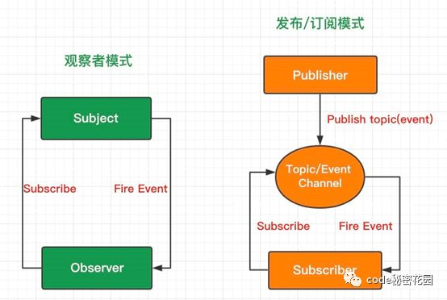

# 观察者模式 & 发布订阅

## observer pattern

观察者模式定义了对象之间的一对多的依赖关系。当一个对象的状态发生改变时，所有依赖于它的对象都将得到通知，并自动更新。
观察模式属于行为模型，行为模型关注的是对象之间的通信，观察者模式就是观察者与被观察者之间的通信。

## publish & subscribe

现在的发布订阅者模式中，称为发布者的发布的消息不会直接发送给订阅者，这意味着发布者和订阅者不知道彼此的存在。发布者与订阅者中间存在着第三个组件，称为消息代理或者调度中心，它维持这发布者与订阅者之间的联系，过滤所有发布者发布的消息并且分发到订阅者。

例如：再微博上很多人关注了 A，A 就是发布者，微博就是消息代理中心，我们就是订阅者。

## 观察者模式 && 发布订阅模式的区别

- 观察者模式：观察者（Observer）直接订阅（Subscribe）主题（Subject），而当主题被激活的时候，会触发（Fire Event）观察者里的事件。

- 发布订阅模式：订阅者（Subscriber）把自己想订阅的事件注册（Subscribe）到调度中心（Topic），当发布者（Publisher）发布该事件（Publish topic）到调度中心，也就是该事件触发时，由调度中心统一调度（Fire Event）订阅者注册到调度中心的处理代码。
